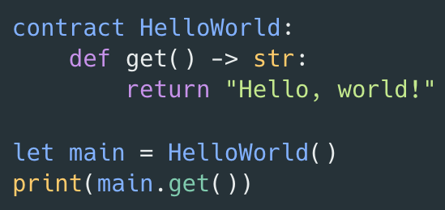

# A1: Develop smart contracts for the Adamnite blockchain

<p align="center">
    <a href="#getting-started">Getting started</a> |
    <a href="#development">Development</a> |
    <a href="#join-us">Join us</a>
</p>

<br/>



[](https://github.com/m-peko/bitflags/blob/master/LICENSE)
[](https://github.com/Adamnite/A1/actions/workflows/build.yml)
[](https://codecov.io/gh/Adamnite/A1)

A1 is a high-level programming language for developing smart contracts for the Adamnite blockchain. With its light syntax, it primarily strives for simplicity and ease of use while retaining the scalability and security required to write immutable multi-party smart contracts.

## Getting started

Learn more about the A1 project:

- [Types](Docs/Types.md)
- [Declarations](Docs/Declarations.md)
- [AOC](AOC/README.md)

## Development

### Building on Mac

First, download this repo and extract to make sure it is an independent directory. Then, make sure you have Homebrew installed. You can install Homebrew by following the instructions [here](https://brew.sh/). Make sure you follow the appropriate instructions after installation to add Homebrew to your path. Once you have installed Homebrew, run the following commands to install the prerequisites:

```sh
$ brew install wget llvm@14 cmake ninja
$ export PATH="$(brew --prefix llvm@14)/bin:${PATH}"
```

Make sure you are in the A1 directory. Then, execute the following commands in order to build the AOC - A1 compiler:

```sh
$ mkdir -p build && cd build
$ cmake -GNinja -DCMAKE_BUILD_TYPE=Release ..
$ ninja
```

### Building on Linux

If you are using a Linux distribution such as Ubuntu or Debian, please refer to these instructions to build the A1 Compiler. First, make sure that you have downloaded the A1 repository, have saved it as an independent directory, and have changed your current directory to A1. Then, execute the following instructions to build the A1 Compiler:

'''sh
$ sudo snap install cmake --classic
$ sudo wget -qO /usr/local/bin/ninja.gz https://github.com/ninja-build/ninja/releases/latest/download/ninja-linux.zip
$ sudo gunzip /usr/local/bin/ninja.gz
$ sudo chmod a+x /usr/local/bin/ninja
$ ninja --version
$ sudo apt update
$ sudo apt install build-essential llvm-14 zlib1g-dev clang
$ sudo apt-get -y install clang-14 libclang-14-dev libffi-dev libedit-dev libpfm4-dev libtinfo-dev
$ sudo touch /usr/lib/llvm-14/lib/libMLIRSupportIndentedOstream.a
$ mkdir build && cd build && cmake -GNinja -DCMAKE_BUILD_TYPE=Release ..
$ ninja
'''


### Writing and compiling an A1 smart contract 


Once the build is successful, you are ready to start playing around! We recommend using [Visual Studio Code](https://code.visualstudio.com/) as your IDE for ease of use and future A1 formatting extension integration. Please note that regardless of your machine, the instructions for writing and compiling your smart contract should be the same. 

You can find examples of basic contracts in the [Examples](https://github.com/Adamnite/A1/tree/main/Examples) directory, such as the "Hello World" example below.

```python
contract HelloWorld:
    def get() -> str:
        return "Hello World!"

let var = HelloWorld()
print(var.get())
```

Once you have written your contract, save it with the ".ao" extension and run the following commands to compile the program and return an output. Be sure to replace "hello_world" with the name of your A1 file.

```sh
$ ./build/bin/aoc hello_world.ao -o output
$ ./output
```

## Join us

A1 is committed to a welcoming environment where everyone can contribute.

- Join the design discussion at our [GitHub forum](https://github.com/Adamnite/A1/discussions)
- See our [contributing guidelines](CONTRIBUTING.md) for information about the A1 development community
- We discuss A1 and other features of the Adamnite Blockchain on [Discord](https://discord.gg/AxbRrXvS)
